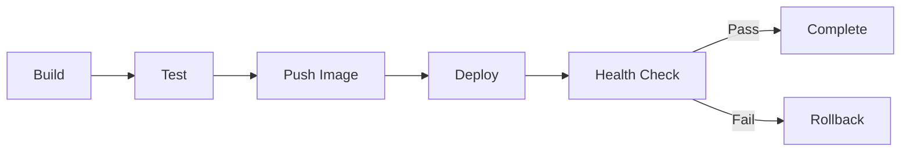

# /deploy

Deploy **game server to production** environment with zero-downtime rolling updates.

## Usage

```bash
/deploy [environment] [--scale=N] [--image-tag=TAG] [--dry-run]
```

## Environments

| Environment | Cluster | Replicas | Purpose |
|-------------|---------|----------|---------|
| `dev` | dev-cluster | 1 | Development testing |
| `staging` | staging-cluster | 3 | Pre-production validation |
| `prod` | prod-cluster | 10+ | Production traffic |

## Deployment Pipeline



## Deployment Steps

### 1. Build Docker Image
```bash
docker build -t game-server:${TAG} \
  --build-arg VERSION=${TAG} \
  --build-arg BUILD_DATE=$(date -u +%Y-%m-%dT%H:%M:%SZ) \
  .
```

### 2. Run Tests
```bash
docker run --rm game-server:${TAG} npm test
```

### 3. Push to Registry
```bash
docker tag game-server:${TAG} ${REGISTRY}/game-server:${TAG}
docker push ${REGISTRY}/game-server:${TAG}
```

### 4. Deploy to Kubernetes
```bash
kubectl set image deployment/game-server \
  game-server=${REGISTRY}/game-server:${TAG} \
  --namespace=${ENVIRONMENT}

kubectl rollout status deployment/game-server \
  --namespace=${ENVIRONMENT} \
  --timeout=300s
```

### 5. Verify Health
```bash
kubectl get pods -l app=game-server -n ${ENVIRONMENT}

# Check health endpoint
curl -f https://game.${ENVIRONMENT}.example.com/health
```

## Rollback Procedure

```bash
# Automatic rollback on failure
kubectl rollout undo deployment/game-server -n ${ENVIRONMENT}

# Manual rollback to specific revision
kubectl rollout undo deployment/game-server -n ${ENVIRONMENT} --to-revision=N
```

## Pre-Deployment Checklist

- [ ] All tests passing
- [ ] Database migrations applied
- [ ] Feature flags configured
- [ ] Alerts configured
- [ ] Runbook updated

## Troubleshooting

### Common Failure Modes

| Error | Root Cause | Solution |
|-------|------------|----------|
| Image pull error | Registry auth | Check imagePullSecrets |
| CrashLoopBackOff | App crash | Check logs, fix code |
| Readiness probe fail | Slow startup | Increase initialDelaySeconds |
| OOMKilled | Memory exceeded | Increase limits |

### Debug Checklist

```bash
# Check deployment status
kubectl describe deployment game-server -n ${ENV}

# Check pod logs
kubectl logs -l app=game-server -n ${ENV} --tail=100

# Check events
kubectl get events -n ${ENV} --sort-by='.lastTimestamp'

# Check resource usage
kubectl top pods -l app=game-server -n ${ENV}
```

## Example Output

```
Deploying game-server to prod...

✓ Building image: game-server:v1.2.3
✓ Running tests: 142/142 passed
✓ Pushing to registry: gcr.io/project/game-server:v1.2.3
✓ Updating deployment: 10 replicas
✓ Health check: https://game.prod.example.com/health

Deployment complete!
- Deployment ID: deploy-abc123
- Replicas ready: 10/10
- Duration: 4m 32s
```
