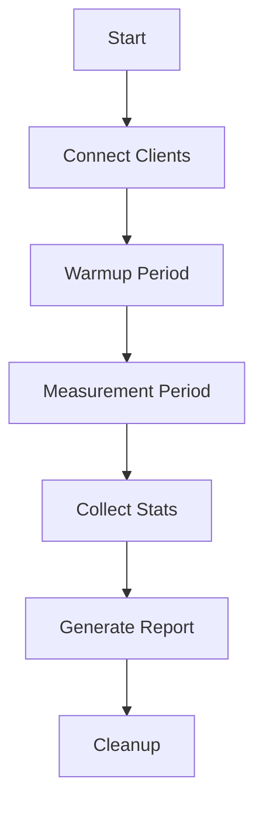

# /network-test

Test **game server networking** with comprehensive latency and load testing.

## Usage

```bash
/network-test <server-url> [--clients=100] [--duration=60] [--protocol=websocket] [--message-rate=60]
```

## Test Types

| Test | Purpose | Metrics |
|------|---------|---------|
| Connection | Verify connectivity | Success rate, handshake time |
| Latency | Measure RTT | Min, avg, p50, p95, p99, max |
| Load | Simulate players | Throughput, error rate |
| Stress | Find breaking point | Max connections, degradation point |

## Test Workflow



## Running Tests

### 1. Connection Test
```javascript
// Test basic connectivity
async function testConnection(url) {
    const start = performance.now();
    const ws = new WebSocket(url);

    return new Promise((resolve, reject) => {
        ws.onopen = () => {
            const handshakeTime = performance.now() - start;
            ws.close();
            resolve({ success: true, handshakeTime });
        };
        ws.onerror = (err) => reject(err);
    });
}
```

### 2. Latency Test
```javascript
// Measure round-trip time
async function measureLatency(ws) {
    const latencies = [];

    for (let i = 0; i < 100; i++) {
        const start = performance.now();
        ws.send(JSON.stringify({ type: 'ping', ts: start }));

        await new Promise(resolve => {
            ws.onmessage = (event) => {
                const rtt = performance.now() - start;
                latencies.push(rtt);
                resolve();
            };
        });
    }

    return calculatePercentiles(latencies);
}
```

### 3. Load Test
```javascript
// Simulate concurrent players
async function loadTest(url, clientCount, duration) {
    const clients = [];

    // Connect all clients
    for (let i = 0; i < clientCount; i++) {
        clients.push(createGameClient(url));
    }

    // Run for duration
    const stats = { sent: 0, received: 0, errors: 0 };

    await Promise.all(clients.map(client =>
        simulateGameplay(client, duration, stats)
    ));

    return stats;
}
```

### 4. Stress Test
```javascript
// Find breaking point
async function stressTest(url, maxClients) {
    let clients = 0;
    let lastGoodClients = 0;

    while (clients < maxClients) {
        clients += 100;

        const result = await loadTest(url, clients, 30);

        if (result.errorRate > 0.01 || result.latencyP99 > 100) {
            console.log(`Breaking point: ${clients} clients`);
            break;
        }

        lastGoodClients = clients;
    }

    return { maxClients: lastGoodClients };
}
```

## Interpreting Results

### Latency Thresholds

| Latency | Rating | Suitable For |
|---------|--------|--------------|
| < 20ms | Excellent | FPS, fighting |
| 20-50ms | Good | Most action games |
| 50-100ms | Acceptable | RPG, strategy |
| > 100ms | Poor | Turn-based only |

### Connection Success Rate

| Rate | Status |
|------|--------|
| > 99.9% | Excellent |
| 99-99.9% | Good |
| 95-99% | Needs attention |
| < 95% | Critical |

## Troubleshooting

### Common Failure Modes

| Error | Root Cause | Solution |
|-------|------------|----------|
| Connection refused | Server down | Check server status |
| Handshake timeout | Firewall | Check network config |
| High latency | Server overload | Scale horizontally |
| Packet loss | Network issues | Check infrastructure |

### Debug Checklist

```bash
# Check server reachability
nc -zv game-server.example.com 8080

# Check WebSocket endpoint
wscat -c wss://game-server.example.com:8080

# Monitor server during test
kubectl top pods -l app=game-server --containers

# Capture network traffic
tcpdump -i any port 8080 -w test-capture.pcap
```

## Example Output

```
Network Test Results
====================

Server: wss://game.example.com:8080
Protocol: WebSocket
Clients: 100
Duration: 60s
Message Rate: 60 msg/s

Connection Results:
┌──────────────┬─────────┐
│ Metric       │ Value   │
├──────────────┼─────────┤
│ Total        │ 100     │
│ Successful   │ 100     │
│ Failed       │ 0       │
│ Success Rate │ 100.0%  │
└──────────────┴─────────┘

Latency Results:
┌──────────────┬─────────┐
│ Percentile   │ Value   │
├──────────────┼─────────┤
│ Min          │ 8ms     │
│ Avg          │ 15ms    │
│ P50          │ 12ms    │
│ P95          │ 28ms    │
│ P99          │ 45ms    │
│ Max          │ 89ms    │
└──────────────┴─────────┘

Throughput Results:
┌──────────────────┬────────────┐
│ Metric           │ Value      │
├──────────────────┼────────────┤
│ Messages Sent    │ 360,000    │
│ Messages Recv    │ 359,982    │
│ Bytes Sent       │ 18.5 MB    │
│ Bytes Received   │ 72.3 MB    │
│ Messages/sec     │ 6,000      │
│ Loss Rate        │ 0.005%     │
└──────────────────┴────────────┘

Errors:
┌──────────────────┬─────────┐
│ Type             │ Count   │
├──────────────────┼─────────┤
│ Connection       │ 0       │
│ Timeout          │ 18      │
│ Protocol         │ 0       │
└──────────────────┴─────────┘

Test Result: PASSED ✓

All thresholds met:
✓ Connection success rate: 100% (threshold: 99%)
✓ Latency P99: 45ms (threshold: 100ms)
✓ Message loss rate: 0.005% (threshold: 0.1%)
```
